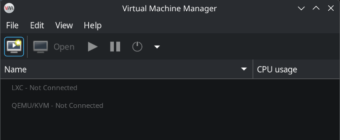
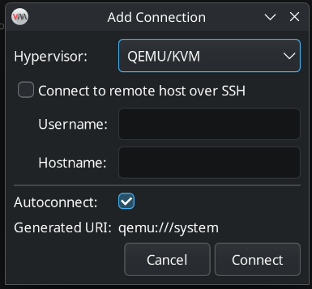
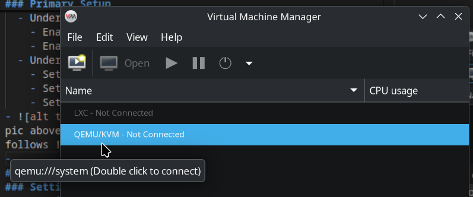
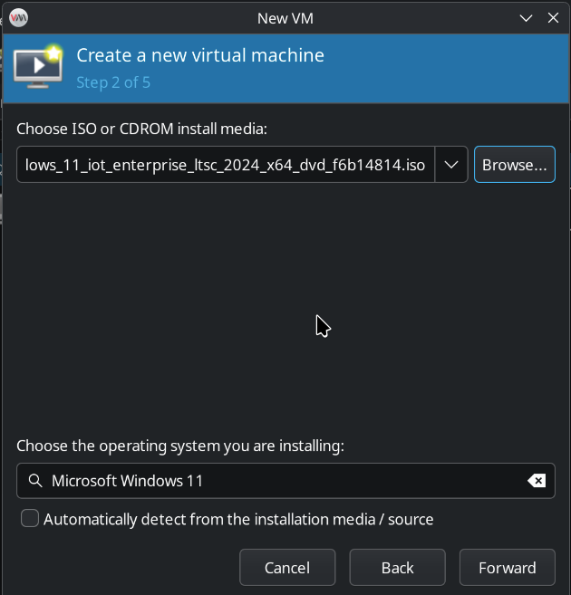
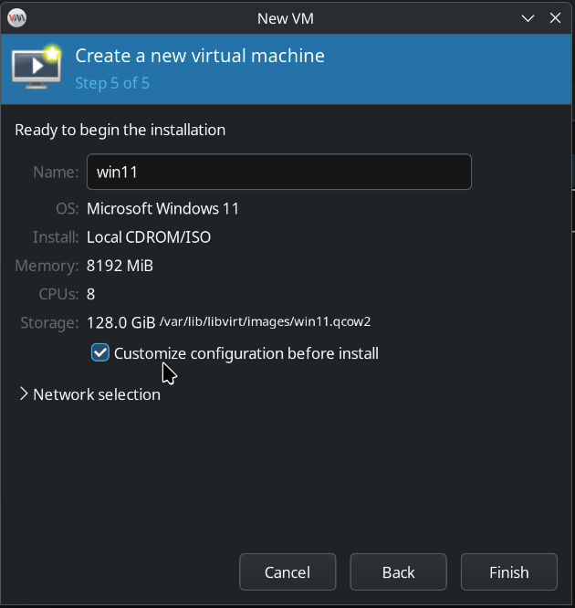
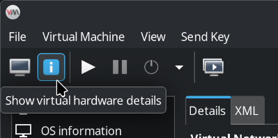

# Guide for creating VMs (Linux hosts/Windows guests) with GPU Passthrough
**IT is HIGHLY RECOMMENDED to avoid Home Editions of Windows, as they don't support being RDP hosts**

### Primary Setup
#### Installation on Arch Linux based systems
- On Arch-based systems:
```bash
sudo pacman -Syu virt-manager qemu-full libguestfs guestfs-tools iptables-nft
```
- Enable `libvirtd.service` and `libvirtd.socket`
```bash
systemctl enable --now libvirtd.service
systemctl enable --now libvirtd.socket
```
- Ensure the variable is`firewall_backend=iptables` in `/etc/libvirt/network.conf` for NAT to function
- Enable `default` NAT adapter
```bash
sudo virsh net-start default
sudo virsh net-autostart default
```
#### Configuring `virt-manager`
- Open `Virtual Machine Manager`
- Goto `Edit > Preferences`
  - Under `General`
    - Enable `Enable XML Editing`
    - Enable `Enable libguestfs VM Introspection`
  - Under `New VM`
    - Set `x86 Firmware` to `UEFI`
    - Set `CPU Default` to `host-passthrough`
    - Set `Storage Format` to `QCOW2` (optional)
-  If QEMU/KVM doesn't exist like the pic above, Goto `File > Add Connection` and configure as follows (Make sure you are using the system instance of qemu by ensuring the Generated URI field reads `qemu:///system`)  
- Double-click on QEMU/KVM if it shows Not Connected 
- `virt-manager` is now ready for creating and running VMs

#### Creating VMs
- Finally, click the shiny monitor icon near the top-right and create a new VM
- While using the wizard, choose the installed OS manually by unticking the auto detect checkbox **ENSURE OS TYPE IS THE SAME OS YOU ARE GOING TO INSTALL** 
- On the last screen, select `Customize configuration before install` 
- **(Windows Guests)** Download the VirtIO guest tools iso for Windows so we can have disk and network drivers.
  - [Download VirtIO driver iso](https://fedorapeople.org/groups/virt/virtio-win/direct-downloads/archive-virtio/virtio-win-0.1.271-1/)
- **(Windows Guests)** Add an emulated CD-ROM drive with our VirtIO drivers from `Add Hardware > Storage (In the sidebar) > Device Type: CDROM Device` and select the VirtIO driver ISO file, then click Ok to close the dialog box
- On default configurations, `virt-manager` will default to an emulated SATA disk as your storage drive. To enjoy better performance, select `SATA Disk 1` from the sidebar and change `Disk Bus:` to `VirtIO`
- Similarly, you can select `NIC:(random characters)` from the sidebar and change `Device Model:` to `VirtIO`
- Finally, select `Begin Installation` on the top-left corner and begin installation
- **(Windows Guests)** At the disk partitioning screen, the installer will complain about having no disks to install to. Click `Load Drivers`, then `Browse` and goto `(VirtIO disk) > vioscsi > (windows version) > AMD64` and click Ok to let the installer find the driver. Afterwards, our main disk should be visible in the disk partitioning screen
- **Continue the installation as normal**
- You can customize the VM after installation by switching from the Graphical Console view to the Hardware Details view on the top-left 

### Installing Spice and VirtIO guest tools (Windows Guests)
- After installation has finished, navigate to the emulated CDROM drive with the VirtIO drivers in Windows Explorer and install the guest tools
- Afterwards, visit these two links inside the VM and install the Spice guest tools
  - [Spice Guest tools](https://www.spice-space.org/download/windows/spice-guest-tools/spice-guest-tools-latest.exe)
  - [Spice Webdavd](https://www.spice-space.org/download/windows/spice-webdavd/)

### Setting up RDP
- Enable Remote Connections inside your Windows guest. Google how to.
- While the VM is running, Goto Hardware Details view, click on the `NIC:(random characters)` device from the sidebar and take a note of the IP Address 
- Note that the user account you want to RDP to in the Windows guest must have a password set
- Install a RDP client, `krdc` is a very nice and robust client.
- Enter the IP Address in the address field and connect to it
- On the login prompt, enter your Windows username and password to connect

### Setting up GPU Passthrough
- While the VM is powered off, Goto the Hardware Details view, then `Add Hardware > PCI Host Device` and select one of the vGPUs/GPU you want to passthrough to the VM.
- **(Intel iGPUs)** To avoid the Code 43 error with the i915 sriov dkms drivers, follow [this thread](https://github.com/strongtz/i915-sriov-dkms/issues/8#issuecomment-1567465036) and add a <vendor_id> tag

### Setting up USB Passthrough
- - While the VM is powered off, Goto the Hardware Details view, then `Add Hardware > USB Host Device` and select one of the vGPUs/GPU you want to passthrough to the VM.